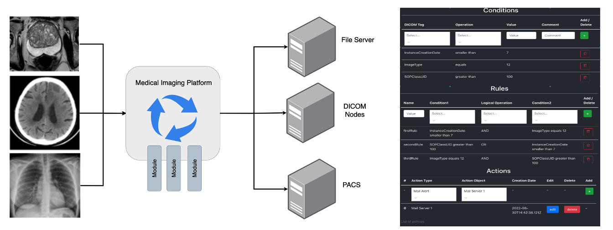
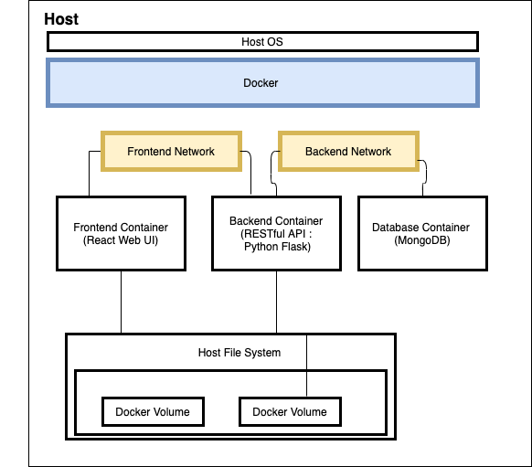
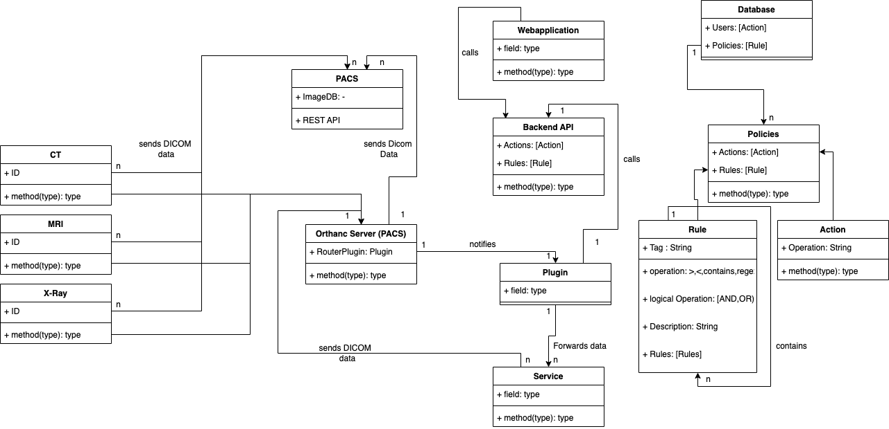

---

# DICOM Routing Platform

A Dockerized platform that provides a complete workflow for storing, viewing, and routing DICOM data, alongside additional services like mailing, FTP, and Redis caching. It leverages a React frontend, Flask API, MongoDB, Orthanc for DICOM handling, and other support services.


**Disclaimer**:
This project is an early-stage prototype under active development. It is provided “as is” and without any warranty, whether express or implied, including but not limited to warranties of merchantability, fitness for a particular purpose, or non-infringement. No guarantees are made regarding its functionality, reliability, or suitability for production or clinical environments. Use it at your own risk. Furthermore, make sure to change Environment variables and passwords and put the containers into a secure environment. 

This platform is not cleared or certified for medical diagnostics and should not be used for any real-world clinical decision-making. The responsibility to adhere to applicable laws, regulations, and data privacy requirements—especially when handling DICOM or other medical data—rests solely with you, the end user. The authors and contributors accept no liability for any damages or losses arising from the use of this software.

## Table of Contents
- [Prerequisites](#prerequisites)
- [Overview](#overview)
- [Services](#services)
  - [MongoDB](#mongodb)
  - [Mongo Express](#mongo-express)
  - [React Frontend (Client)](#react-frontend-client)
  - [Flask Backend (API)](#flask-backend-api)
  - [Mail Service](#mail-service)
  - [Orthanc](#orthanc)
  - [Redis](#redis)
  - [FTP Service](#ftp-service)
  - [FTP Server](#ftp-server)
- [Environment Variables](#environment-variables)
- [Volumes](#volumes)
- [Networks](#networks)
- [Installation](#installation)
  - [Cloning the Repository](#cloning-the-repository)
  - [Starting the Services](#starting-the-services)
- [Usage](#usage)
- [References](#references)
- [License](#license)

---

## Prerequisites
1. **Docker** installed on your machine (recommended: [Docker Engine 20+](https://docs.docker.com/engine/install/))
2. **Docker Compose** (recommended: [v2.0+](https://docs.docker.com/compose/install/))
3. A `.env` file (or another mechanism) to supply the required [environment variables](#environment-variables).

---

## Overview

This project is a platform for routing and managing DICOM data. The core idea is to have the following:
- A **React** frontend that interacts solely with a **Flask** backend.
- A **Flask** API that handles all logic and communicates with **MongoDB** for data persistence.
- **Orthanc** for handling DICOM images and routing them.
- Additional services like **Redis** for caching, **FTP** for file transfers, and a **Mail Service** for notifications.

All services are orchestrated through Docker Compose, making it easy to spin up the entire stack.

---

## Services

Below is a summary of the services defined in the `docker-compose.yml`.


### MongoDB
- **Image:** `mongo:5.0.2`
- **Purpose:** Primary database for the Flask backend.
- **Ports:** (None exposed externally by default, it’s on internal Docker networks.)
- **Data Volume:** `mongodbdata` for persistent storage of the database.

### Mongo Express
- **Image:** `mongo-express`
- **Purpose:** Lightweight web-based MongoDB administration interface.
- **Ports:** `8887:8081`
- **Access:** [http://localhost:8887](http://localhost:8887)

### React Frontend (Client)
- **Build Context:** `./frontend`
- **Purpose:** Provides the user interface for the DICOM routing platform.
- **Ports:** `3000:3000` 
- **Access:** [http://localhost:3000](http://localhost:3000)

### Flask Backend (API)
- **Build Context:** `./backend`
- **Purpose:** Core backend service that connects to MongoDB. It exposes REST endpoints consumed by the React frontend.
- **Ports:** `5000:5000`
- **Environment Variables:**
  - `MONGODB_HOST`
  - `MONGODB_USERNAME`
  - `MONGODB_PASSWORD`
- **Data Volume:** `backenddata` (mounted at `/app` inside the container for code and logs).

### Mail Service
- **Build Context:** `./mailservice`
- **Purpose:** Handles sending emails/notifications.
- **Ports:** `2020:2020`
- **Notes:** Communicates with the backend or other services if needed.

### Orthanc
- **Build Context:** `./orthanc`
- **Purpose:** DICOM server used to store and handle imaging data.
- **Ports:** `"${ORTHANC_PORT}:${ORTHANC_PORT}"` (set in `.env`)
- **Secrets:** `orthanc.json` (the main Orthanc configuration file).
- **Environment Variables:**
  - `ORTHANC_NAME`
  - Additional plugin config flags.
- **Data Volume:** `orthancdata` for persistent storage of Orthanc database files.

### Redis
- **Image:** `redis:6.0.6`
- **Purpose:** In-memory data store, often used for caching, session management, etc.
- **Ports:** `6379:6379`

### FTP Service
- **Build Context:** `./ftpservice`
- **Purpose:** Custom FTP-related functionality (e.g., for specialized file handling or bridging).
- **Ports:** `3030:3030`
- **Data Volume:** `ftp_data`

### FTP Server
- **Image:** `garethflowers/ftp-server`
- **Purpose:** Generic FTP server to handle file transfers.
- **Ports:** 
  - `20-21:20-21` (FTP control channels)
  - `40000-40009:40000-40009` (Passive mode ports)
- **Volumes:**
  - `./shared:/home/${FTP_USERNAME}/shared`

---

## Environment Variables

Below are the commonly used environment variables. These should be changed and are specified in a `.env` file in the root directory (where `docker-compose.yml` resides).

| Variable                  | Description                                | Example Value         |
|---------------------------|--------------------------------------------|-----------------------|
| `MONGO_INITDB_ROOT_USERNAME` | Root username for MongoDB admin.           | `root`                |
| `MONGO_INITDB_ROOT_PASSWORD` | Root password for MongoDB admin.           | `rootpassword`        |
| `MONGO_API_USER`          | Application-level MongoDB user.            | `mongo_user`          |
| `MONGO_API_PASSWORD`      | Application-level MongoDB password.        | `mongo_pass`          |
| `MONGO_INITDB_DATABASE`   | Default DB name to be created at startup.  | `my_database`         |
| `ME_CONFIG_BASICAUTH_USERNAME` | Basic auth user for Mongo Express.      | `admin`               |
| `ME_CONFIG_BASICAUTH_PASSWORD` | Basic auth password for Mongo Express.  | `password123`         |
| `ORTHANC_PORT`            | Port on host to expose Orthanc UI/API.     | `8042`                |
| `ORTHANC_URL`             | URL used by Orthanc (for references).      | `http://orthanc:8042` |
| `FTP_USERNAME`            | Username for the FTP server.               | `ftpuser`             |
| `FTP_PASSWORD`            | Password for the FTP server.               | `ftppass`             |

> **Note:** Add or remove variables as needed based on your service configurations.

---

## Volumes

- **`mongodbdata`**: Persists MongoDB data.
- **`backenddata`**: Persists data/code for the backend.
- **`ftp_data`**: Persists data used by the FTP service.
- **`orthancdata`**: Persists Orthanc’s internal database.

These volumes ensure your data is retained even if you remove or recreate containers.

---

## Networks

The docker-compose file defines two bridge networks:

- **`frontend`**: Used by the React client, API, mail, and any other service that needs front-facing network connectivity.
- **`backend`**: Used by MongoDB, Orthanc, and other internal services.

Services can communicate with each other within these networks. By default, Docker isolates containers unless they share a network.

---

## Installation

### Cloning the Repository

1. **Clone the git repo** to your local machine:
   ```bash
   git clone 'this-repo-url.git'
   ```
2. Navigate to the `uszh` directory:
   ```bash
   cd uszh
   ```

3. Ensure your `.env` file is present in the `uszh` directory with all necessary [Environment Variables](#environment-variables).

### Starting the Services

1. **Install Docker** (if not already installed).
2. **Install Docker Compose** (if not already installed).
3. Run Docker Compose in detached mode:
   ```bash
   docker compose up -d
   ```
4. Verify that all containers are running:
   ```bash
   docker ps
   ```

---

## Usage

1. **Access the React Frontend**  
   Open a browser and navigate to [http://localhost:3000](http://localhost:3000).

2. **Access the Flask API**  
   By default, the Flask API listens on [http://localhost:5000](http://localhost:5000).

3. **Access Mongo Express**  
   Navigate to [http://localhost:8887](http://localhost:8887). Use the credentials specified in your `.env` file for `ME_CONFIG_BASICAUTH_USERNAME` and `ME_CONFIG_BASICAUTH_PASSWORD`.

4. **Access Orthanc**  
   If you set `ORTHANC_PORT=8042`, Orthanc will be available at [http://localhost:8042](http://localhost:8042).  
   - The default Orthanc admin user/password are typically configured in `orthanc.json`.  
   - You can also configure additional plugins and scripts under `/etc/orthanc/` inside the container, for example `plugin.py`.

5. **FTP Services**  
   - **FTP Service** runs on port `3030`.
   - **FTP Server** is exposed on ports `20-21` and `40000-40009` by default.  
     You can connect using an FTP client pointing to `localhost` with the credentials defined in your `.env`.

6. **Mail Service**  
   Check logs and configurations in `./mailservice` for usage details. It typically runs on [http://localhost:2020](http://localhost:2020).


---


### Closing Notes

- To stop all containers, run:
  ```bash
  docker compose down
  ```
- For debugging any service, run:
  ```bash
  docker compose logs -f <service-name>
  ```
- Update or customize each service's configuration as needed. Each service directory has its own Dockerfile and possibly additional config files.

**Enjoy your DICOM Routing Platform!** If you encounter any issues, make sure to check container logs and verify all required environment variables are set correctly.

--- 
### Domain Model
The following Domain model (incomplete) depicts the workflow in the hospital in collaboration with the tool. 

- The captured data will always to the persistent storage (PACS)
- Additionally, the data will be forwarded to the Orthanc Server (also a PACS) that allows to integrate a python plugin.
- The plugin gets notified by the Orthanc server as soon as new data (DICOM files) arrives. It also gets the Policies (along with the corresponding Rules and Actions) via REST API.
- The API manages requests regarding the Policies (along with the corresponding Rules and Actions)  that are stored in a Database.
- There Is a Webapplication (SPA) that is used to manage Policies.
- The plugin calls services (such as Mail service, ML service, SFTP Forwarding service) according to the defined Actions.
- Services take actions and may change the header or image data of a DICOM file. If so, the files will be sent back to the Orthanc (PACS). Based on the changed data new Actions might be triggered.



### Orthanc Sample Code
https://github.com/amirkogithub/orthanc/tree/master/Resources/Samples

### Mongodb
https://github.com/ArjunAranetaCodes/MoreCodes-Youtube/blob/master/react-flask-mongodb-login-reg/mongo.py


---

## References

- [React + Flask + MongoDB in 5 Minutes (python.plainenglish.io)](https://python.plainenglish.io/up-and-running-with-react-flask-and-mongodb-in-5-minutes-or-less-e9bd038d2bee)  
- [React + Flask + MongoDB Docker Setup (medium.com)](https://medium.com/swlh/how-to-set-up-a-react-app-with-a-flask-and-mongodb-backend-using-docker-19b356180199)  
- [Orthanc Sample Code](https://github.com/amirkogithub/orthanc/tree/master/Resources/Samples)  
- [MongoDB Login/Reg Sample (MoreCodes-Youtube)](https://github.com/ArjunAranetaCodes/MoreCodes-Youtube/blob/master/react-flask-mongodb-login-reg/mongo.py)